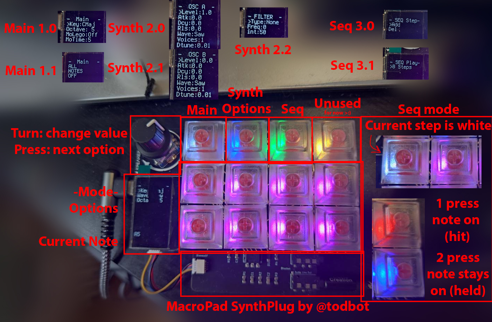

# macrosynth
###### Demo coming soon™!
  
A synth for the Adafruit MacroPad RP2040 using TodBot's Synthplug for audio out.  
A headphone amplifier may be required to use headphones, and a portable battery can avoid the annoying hum when powering the macropad from a computer.

Components:
 - Adafruit MacroPad RP2040 (CAD$77)
   - https://www.adafruit.com/product/5128
   - (was out of stock so I got mine through digikey)
   - https://www.digikey.ca/en/products/detail/adafruit-industries-llc/5128/14635377
 - Todbot's MacroPadSynthPlug - or another way to get audio out from the RP2040 (code will probably need to be updated)  
 
   - https://www.tindie.com/products/todbot/macropadsynthplug-turn-rp2040-into-a-synth/
   - https://github.com/todbot/macropadsynthplug
   - Shipped very quick (even before the board!)
   
A *large* part of the complicated timing and clock/BPM sync was adapted from @todbot's drum machine project (linked above)

# Usage

A very basic 2x osc synth (at the moment), the top keys select the various menus displayed on the screen on the left, with the bottom 8 keys playing the notes root5 -> root6

## Main
### 1.0 (Main page 1)
Selected by default
 - Key [Maj only atm - although if you know your relative minors this won't matter XD]
   - selects the root note and changes the scale of the 8 keys
 - Octave [-1 - 8]
   - Changing the octave and placing a note in the sequencer does not remove the previous note, even if the pad is still lit (ie, C6 and C4 can trigger on the same beat, but the pad will not visually convey this - unsure on fix? Soln: remember what notes you pressed :P)
 - Mono-Legato [on, off]
 - Time [Lower = longer slide time, higher = faster]

Mono-legato is achieved by attaching a linear LFO (ie, y=x) to the pitch-bend of a note to bend it to the new note:

This function works even when intermediate notes are released:
 - D5 held, D5 plays
 - B5 held, D5 bends to B5
 - G5 held, B5 bends to G5
  - If G5 is released, G5 bends back down to B5
  - If G5 is held, and B5 is released, then when G5 is released it will bend down to D5

In short, when a key is released, it will bend to the most recently played, still-held note.

Completely broken in the sequencer. I suspect it has something to do with how the note_off function is handled  
**TODO**: Fix this 

### 1.1 (Main page 2)
turns off all active notes (panic button)

## Synth options
editing the detune or voicing requires the note to be retriggered, but the wave type and filter can be adjusted while the note is being held
### 2.0 (Synth page 1)
 - Level
   - volume of the osc, is mapped to the attack level of the envelope
 - AD(S)R options
   - I didn't see a need for sustain so I took it out to save on menu space
   - **If the notes played in the sequencer sound really plucky (and you don't want that), you have to increase the release a bit since they're only hit for a single clock cycle**
 - Wave [Saw, Square, Sine, DistSine (sine wave convolved with a noise func.), Noise]
 - Voices [1-12]
   - Works by duplicating the note when played with a random offset defined by the detune amount
   - **Synthio on the RP2040 supports a MAX of 12 notes, and each voice counts as a note**
 - DTune
   - Detune: the amount each voice differs from each other. Each voice is placed this amount higher or lower than the previous one.
   - ie: voice 1 = freq, voice 2 = freq + detune\*1 (up), voice 3 = freq + -detune\*2 (down), etc

### 2.1 (Synth page 2)
Same as above, but for OSC B. Level is 0 by default

### 2.2 (Synth page 3)
 - Filter Type [None, Low-pass, High-pass, Band-pass]
 - Filter Frequency
 - Filter increments
   - How many Hz the frequency is adjusted by

## Sequencer
### 3.0 (Seq page 1)
Sequencer BPM is 120. I can't believe I forgot to add a option to change this (editable in the code tho).  
**TODO**: add bpm option to seq menu

Pressing the sequencer key once enters the step sequencer mode. Scroll the encoder to select the step to edit (the current step is highlighted).  
 - Pressing a note once turns it red. This is a *hit*, it will be triggered on that beat.  
 - Pressing a hit again turns it blue. This is a *hold*, if, on the beat before, this note was hit, it will hold that note (ie, not turn off between beats)

As mentioned above, a note of differing octaves can occur on the same beat, just without the visual feedback.  

**TODO**: Add options to change different notes' synth options independently (use the orange button to cycle through presets?)

Pressing the encoder to the ">Del" option clears the current step, sweep through the steps to clear all

### 3.1 (Seq page 2)
Press the sequencer key again to play the sequence, turn the encoder on this screen to expand the steps (doubles the current steps), with different colours to signify where you are in 2 bar loop (Pink -> Blue -> Yellow -> White)   
**TODO**: 8 steps = 0.5 Bar is kinda weird, maybe allow user to change how long each step is?

While the sequencer is playing, you can leave the sequencer page and it will continue playing, allowing you to change the synth options as the sequence plays
